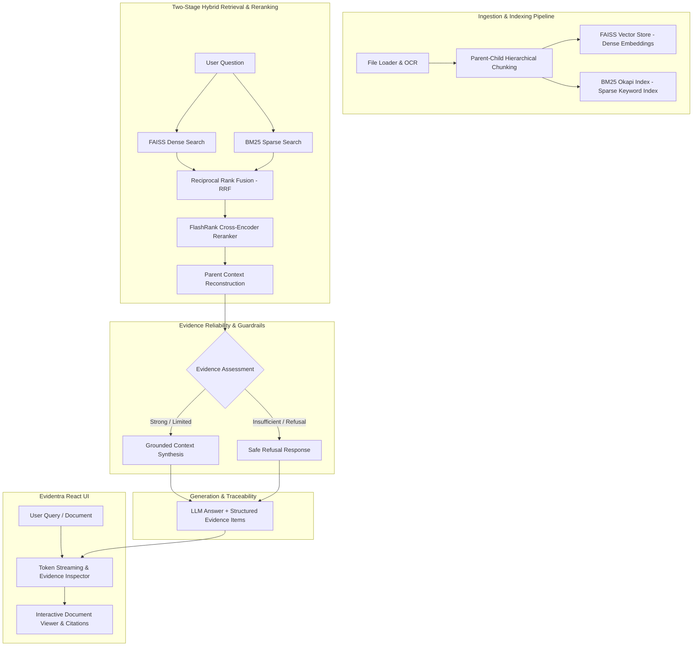

# Evidentra — Evidence-Backed Document Intelligence Platform ⚡

**Evidentra** is an enterprise-grade document intelligence and Retrieval-Augmented Generation (RAG) platform built on the principle: **"From documents to defensible answers."** It delivers verifiable answers supported by retrieved evidence and traceable sources, solving precision, recall, and hallucination challenges through **Hybrid Dense+Sparse Search (BM25 + FAISS + RRF)**, **Two-Stage Cross-Encoder Reranking**, **Parent-Child Hierarchical Chunking**, a **Real Evidence Inspector**, and an **Empirical RAG Evaluation Suite**.

---

## 🎯 Architecture Diagram



---

## 🔥 Key Technical Highlights & Engineering Decisions

### 1. Hybrid Search (Dense FAISS + Sparse BM25 + Reciprocal Rank Fusion)
- **Problem:** Dense vector embeddings miss exact product codes, acronyms, dates, and proper names due to semantic smoothing.
- **Solution:** Integrated BM25Okapi keyword search alongside FAISS vector search, fused via Reciprocal Rank Fusion (RRF):
  $$\text{RRF\_Score}(d) = \sum_{m \in M} \frac{1}{60 + r_m(d)}$$
- **Impact:** Eliminates keyword drop-offs and dramatically improves Evidence Recall.

### 2. Two-Stage Retrieval with Cross-Encoder Reranking
- **Problem:** Vector search top-K results often contain semantically close but noisy chunks.
- **Solution:** Retrieve top candidate chunks via Hybrid RRF, then pass passages through a lightweight **Cross-Encoder Reranker** (`ms-marco-MiniLM-L-6-v2`) for fine-grained attention scoring.
- **Impact:** Filters noisy passages and elevates precise ground-truth evidence to top ranks.

### 3. Parent-Child Hierarchical Chunking
- **Problem:** Small chunks miss surrounding section context; large chunks dilute vector search similarity.
- **Solution:** Split documents into parent sections and child search vectors. High-precision vector matches trigger full parent context assembly in the LLM prompt.

### 4. Deterministic Evidence Reliability & Inspector
- **Problem:** Raw confidence percentages (e.g. "94% confident") are often uncalibrated and misleading.
- **Solution:** Evidentra uses deterministic evidence support states (`STRONG EVIDENCE`, `LIMITED EVIDENCE`, `INSUFFICIENT EVIDENCE`) based on verified chunk counts and cross-encoder scores, paired with an inline **Evidence Inspector** that exposes the exact retrieved passages with direct `[Open Source]` jumping.

### 5. Empirical RAG Evaluation Framework (`backend/evaluation/`)
- Non-simulated benchmark suite testing live vector search, BM25 retrieval, RRF fusion, and guardrails across real document questions without fake percentages.

---

## 🛠️ Tech Stack

| Layer | Technology |
|---|---|
| **Backend API** | FastAPI (Async), Python 3.11+, Pydantic v2 |
| **Dense Search** | FAISS, `sentence-transformers/all-MiniLM-L6-v2` |
| **Sparse Search** | `rank-bm25` (Okapi BM25) |
| **Reranking** | FlashRank / Cross-Encoder (`ms-marco-MiniLM-L-6-v2`) |
| **LLM Support** | OpenAI (GPT-4o/3.5), Ollama (Llama 3/Phi-3), HuggingFace |
| **Database** | MongoDB (Atlas / Local) |
| **Evaluation** | Custom Empirical Benchmark Suite, Pytest |
| **Frontend** | React 18, Vite, Tailwind CSS, Lucide React, KaTeX |

---

## 🚀 Quick Start

### 1️⃣ Backend Setup

```bash
cd backend
python -m venv .venv
# On Windows:
.venv\Scripts\activate
# On Linux/macOS:
source .venv/bin/activate

pip install -r requirements.txt
```

Run tests:
```bash
pytest -v
```

Run Empirical Evaluation Benchmark:
```bash
python -m evaluation.run_evaluation --skip-llm
```

Start backend dev server:
```bash
python dev.py
```

### 2️⃣ Frontend Setup

```bash
cd frontend
npm install
npm run dev
```
